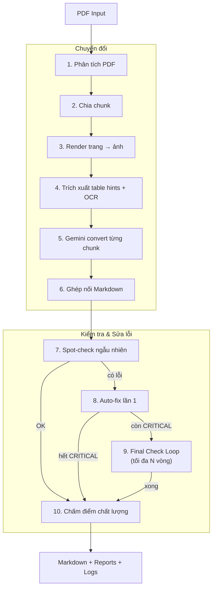
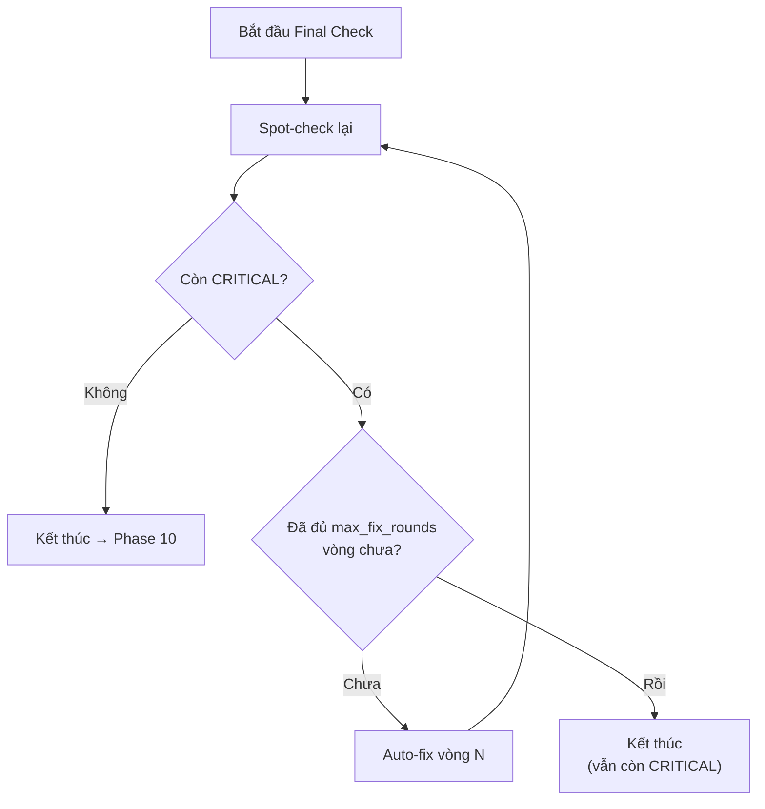
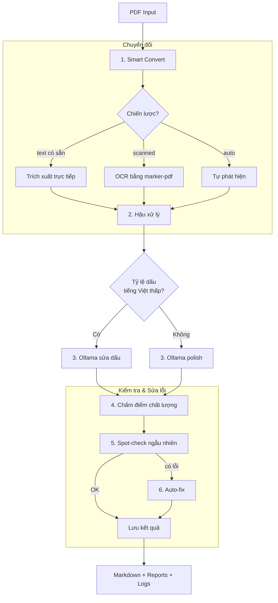
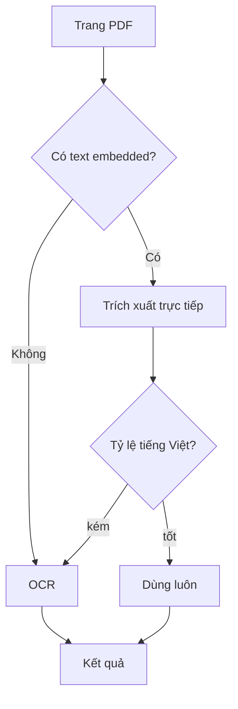

# ConvertPDF — PDF to Markdown Pipeline

Chuyển đổi văn bản pháp quy tiếng Việt (PDF) sang Markdown chất lượng cao.  
Hỗ trợ hai chế độ: **Online** (Gemini AI) và **Offline** (marker-pdf + Ollama).

---

## Cấu trúc dự án

```
ConvertPDF/
├── run.py                    # CLI entry — Online pipeline
├── requirements.txt          # Dependencies (online)
├── .env                      # GEMINI_API_KEY
├── inputs/                   # PDF gốc
├── outputs/                  # Kết quả online
├── temp/                     # Cache Gemini
├── src/                      # Source online pipeline
│   ├── config.py             # Config & API key
│   ├── analyzer.py           # Phân tích PDF (trang, bảng, ảnh, scanned)
│   ├── planner.py            # Chia chunk theo chiến lược
│   ├── renderer.py           # Render PDF → ảnh PNG
│   ├── extractor.py          # Trích xuất table hints (PyMuPDF + Tesseract)
│   ├── converter.py          # Gọi Gemini chuyển đổi chunk → Markdown
│   ├── prompts.py            # Prompt templates cho Gemini
│   ├── assembler.py          # Ghép nối chunks thành file hoàn chỉnh
│   ├── postprocess.py        # Hậu xử lý Markdown (loại rác, sửa bảng)
│   ├── quality.py            # Chấm điểm chất lượng tổng thể
│   ├── spot_check.py         # Kiểm tra ngẫu nhiên bằng AI
│   ├── auto_fix.py           # Tự động sửa lỗi phát hiện được
│   └── pipeline.py           # Điều phối toàn bộ pipeline
├── offline/                  # Source offline pipeline
│   ├── config_offline.py     # Config offline
│   ├── converter_marker.py   # Convert bằng marker-pdf / pdftext
│   ├── polisher_ollama.py    # Polish & sửa dấu tiếng Việt bằng Ollama
│   ├── quality_offline.py    # Chấm điểm chất lượng (offline)
│   ├── spot_check_offline.py # Kiểm tra ngẫu nhiên bằng Ollama
│   ├── auto_fix_offline.py   # Tự động sửa lỗi bằng Ollama
│   ├── run_offline.py        # CLI entry — Offline pipeline
│   └── requirements.txt      # Dependencies (offline)
└── outputs_offline/          # Kết quả offline
```

---

## Online Pipeline (Gemini AI)

Sử dụng Google Gemini để chuyển đổi PDF sang Markdown với chất lượng cao nhất.  
Yêu cầu: kết nối internet + `GEMINI_API_KEY`.

### Lưu đồ



### Diễn giải chi tiết từng phase (Online)

| Phase | Input | Hành động | Output |
|-------|-------|-----------|--------|
| 1. Phân tích PDF | File PDF gốc | Đọc metadata: số trang, kích thước, tỷ lệ scanned, có bảng/ảnh không, ước tính token | `PDFAnalysis` (thông tin cấu trúc PDF) |
| 2. Chia chunk | `PDFAnalysis` + config chunk_size | Chia PDF thành nhiều nhóm trang (chunk), mỗi chunk ~10 trang, ưu tiên giữ nguyên bảng trong cùng chunk | Danh sách `ChunkPlan` (trang bắt đầu/kết thúc, chiến lược) |
| 3. Render ảnh | PDF + danh sách chunk | Render từng trang PDF thành ảnh PNG ở DPI cao (300) để gửi cho Gemini | Ảnh PNG mỗi trang trong `temp/` |
| 4. Table hints + OCR | PDF + ảnh trang | PyMuPDF trích xuất text + bảng có sẵn trong PDF; Tesseract OCR cho trang scanned | `ChunkExtraction` (text, bảng, confidence mỗi trang) |
| 5. Gemini convert | Ảnh trang + table hints + prompt | Gửi ảnh + context cho Gemini, nhận về Markdown cho từng chunk; có cache để không gọi lại | Markdown thô cho từng chunk |
| 6. Ghép nối | Markdown các chunk | Nối các chunk lại, loại bỏ heading trùng, chạy hậu xử lý (xóa rác, sửa bảng, chuẩn hóa) | File `.md` hoàn chỉnh (bản đầu tiên) |
| 7. Spot-check | Markdown + PDF gốc | Chọn ngẫu nhiên N vị trí, gửi ảnh trang gốc + đoạn Markdown tương ứng cho Gemini so sánh | `SpotCheckReport` (danh sách lỗi: critical/warning/ok) |
| 8. Auto-fix lần 1 | Markdown + danh sách lỗi + PDF gốc | Với mỗi lỗi, gửi ảnh trang gốc + đoạn lỗi + mô tả cho Gemini sửa, thay thế vào Markdown | Markdown đã sửa + `AutoFixReport` |
| 9. Final Check Loop | Markdown đã sửa + PDF gốc | Spot-check lại → nếu còn CRITICAL thì fix tiếp → lặp tối đa N vòng | Markdown cuối cùng + report mỗi vòng |
| 10. Chấm điểm | Markdown cuối + PDF gốc | So sánh tổng thể: độ đầy đủ text, cấu trúc heading, bảng, tiếng Việt → cho điểm /10 | `quality_report.json` (điểm + chi tiết) |

### Final Check Loop (Phase 9)



### Sử dụng

```bash
# Chạy tất cả PDF trong inputs/
python run.py

# Chạy 1 file cụ thể
python run.py -i "inputs/document.pdf"

# Tùy chỉnh
python run.py --model gemini-2.5-pro --max-fix-rounds 5 --dpi 300

# Dry-run (không gọi Gemini)
python run.py --dry-run

# Chỉ phân tích
python run.py --analyze-only
```

### Tham số CLI

| Tham số | Mặc định | Mô tả |
|---------|----------|-------|
| `--input, -i` | - | File PDF cụ thể |
| `--input-dir` | `inputs/` | Thư mục chứa PDF |
| `--output-dir` | `outputs/` | Thư mục lưu kết quả |
| `--model` | `gemini-3-flash-preview` | Model chuyển đổi |
| `--verify-model` | `gemini-2.5-flash-lite` | Model kiểm tra |
| `--chunk-size` | `10` | Số trang mỗi chunk |
| `--dpi` | `300` | DPI render ảnh |
| `--max-fix-rounds` | `3` | Số vòng final check loop tối đa |
| `--no-quality-check` | - | Bỏ qua chấm điểm |
| `--no-spot-check` | - | Bỏ qua kiểm tra ngẫu nhiên |
| `--no-auto-fix` | - | Bỏ qua tự động sửa |
| `--clear-cache` | - | Xóa cache, convert lại từ đầu |
| `--verbose, -v` | - | Log chi tiết |

### Output cho mỗi file

```
outputs/<tên_file>/
├── output_<tên_file>.md        # Markdown cuối cùng
├── pipeline.log                # Log toàn bộ pipeline
├── quality_report.json         # Điểm chất lượng
├── spot_check_report.json      # Kết quả spot-check
├── spot_check.log              # Log chi tiết spot-check
├── auto_fix_report.json        # Kết quả auto-fix
├── auto_fix.log                # Log chi tiết auto-fix
├── final_check_round_N.json    # Report vòng N (nếu có)
├── auto_fix_round_N.json       # Fix report vòng N (nếu có)
└── images/                     # Ảnh trích xuất
```

---

## Offline Pipeline (marker-pdf + Ollama)

Chạy hoàn toàn offline, không cần internet. Sử dụng `marker-pdf` cho chuyển đổi  
và `Ollama` (local LLM) cho kiểm tra + sửa lỗi.

### Lưu đồ



### Smart Text Extraction (Phase 1)



### Diễn giải chi tiết từng phase (Offline)

| Phase | Input | Hành động | Output |
|-------|-------|-----------|--------|
| 1. Smart Convert | File PDF gốc | Tự chọn chiến lược: thử trích xuất text trực tiếp (pdftext) trước, kiểm tra tỷ lệ tiếng Việt; nếu kém thì chuyển sang OCR bằng marker-pdf (Surya) | Markdown thô + thông tin strategy đã dùng |
| 2. Hậu xử lý | Markdown thô | Loại prompt leak, sửa bảng vỡ, xóa số trang nhúng, chuẩn hóa heading, xóa rác OCR | Markdown đã làm sạch |
| 3. Ollama sửa dấu / polish | Markdown + ảnh trang PDF | Nếu tỷ lệ dấu tiếng Việt < 5%: gửi từng đoạn kèm ảnh gốc cho Ollama phục hồi dấu thanh. Nếu >= 5%: Ollama polish chỉnh sửa nhẹ | Markdown với tiếng Việt đúng dấu |
| 4. Chấm điểm | Markdown + PDF gốc | Kiểm tra độ đầy đủ text, cấu trúc, bảng, tiếng Việt; tùy chọn gửi Ollama đánh giá AI | `quality_report.json` (điểm /10) |
| 5. Spot-check | Markdown + PDF gốc | Chọn ngẫu nhiên 5 vị trí, gửi ảnh trang + Markdown cho Ollama so sánh tìm lỗi | `SpotCheckReport` (critical/warning/ok) |
| 6. Auto-fix | Markdown + danh sách lỗi + PDF gốc | Với mỗi lỗi, gửi ảnh + đoạn lỗi cho Ollama sửa, thay vào Markdown | Markdown cuối + `AutoFixReport` |

### Smart Text Extraction (Phase 1 chi tiết)

| Bước | Input | Hành động | Output |
|------|-------|-----------|--------|
| Kiểm tra text | Trang PDF | Thử trích xuất text trực tiếp bằng pdftext (không OCR) | Text thô (có thể rỗng nếu trang scanned) |
| Kiểm tra chất lượng | Text thô | Tính tỷ lệ ký tự tiếng Việt có dấu (ă, ơ, ê, ố...) | Tỷ lệ VN% |
| Quyết định | Tỷ lệ VN% | Nếu > 5% → dùng text trực tiếp. Nếu <= 5% → fallback sang marker-pdf OCR | Text cuối cùng cho trang đó |

### Sử dụng

```bash
# Chạy tất cả PDF
python -m offline.run_offline

# Chạy 1 file cụ thể
python -m offline.run_offline -i "inputs/document.pdf"

# Với Ollama polish + spot-check + auto-fix
python -m offline.run_offline --use-ollama

# Chọn chiến lược trích xuất
python -m offline.run_offline --strategy pdftext

# Trên máy có GPU
python -m offline.run_offline --device cuda
```

### Tham số CLI

| Tham số | Mặc định | Mô tả |
|---------|----------|-------|
| `--input, -i` | - | File PDF cụ thể |
| `--input-dir` | `inputs/` | Thư mục chứa PDF |
| `--output-dir` | `outputs_offline/` | Thư mục lưu kết quả |
| `--device` | `mps` | Thiết bị: `mps` / `cpu` / `cuda` |
| `--strategy` | `auto` | Chiến lược: `auto` / `marker` / `pdftext` / `hybrid` |
| `--use-ollama` | - | Bật Ollama local LLM |
| `--ollama-model` | `qwen3-vl:8b` | Model Ollama |
| `--force-ocr` | - | Force OCR tất cả trang |
| `--no-quality-check` | - | Bỏ qua chấm điểm |
| `--no-spot-check` | - | Bỏ qua kiểm tra ngẫu nhiên |
| `--no-auto-fix` | - | Bỏ qua tự động sửa |
| `--verbose, -v` | - | Log chi tiết |

---

## So sánh Online vs Offline

| Tiêu chí | Online (Gemini) | Offline (marker-pdf) |
|----------|----------------|---------------------|
| Chất lượng chuyển đổi | Rất cao | Tốt (phụ thuộc PDF) |
| Yêu cầu internet | Có | Không |
| Chi phí | API cost | Miễn phí |
| Tốc độ | Chậm hơn (API calls) | Nhanh hơn (local) |
| Xử lý bảng phức tạp | Tốt (vision AI) | Trung bình |
| Tiếng Việt dấu thanh | Tốt | Cần smart extract + repair |
| Kiểm tra chất lượng | Gemini spot-check | Ollama spot-check |
| Final check loop | Có (tối đa N vòng) | Chưa có |

---

## Cài đặt

```bash
# Clone & setup
git clone <repo-url>
cd ConvertPDF
python -m venv .venv
source .venv/bin/activate

# Online pipeline
pip install -r requirements.txt
echo "GEMINI_API_KEY=your_key_here" > .env

# Offline pipeline
pip install -r offline/requirements.txt

# Offline + Ollama (optional)
# Cài Ollama: https://ollama.com
ollama pull qwen3-vl:8b
```

---

## Logging

Cả hai pipeline đều ghi log đầy đủ:

- **Console**: Rich progress bars + bảng tóm tắt
- **pipeline.log**: Log chi tiết toàn bộ phase (thời gian, số liệu, lỗi)
- **spot_check.log**: Chi tiết từng vị trí kiểm tra
- **auto_fix.log**: Chi tiết từng lỗi đã sửa / không sửa được
- **JSON reports**: Dữ liệu có cấu trúc để phân tích sau
